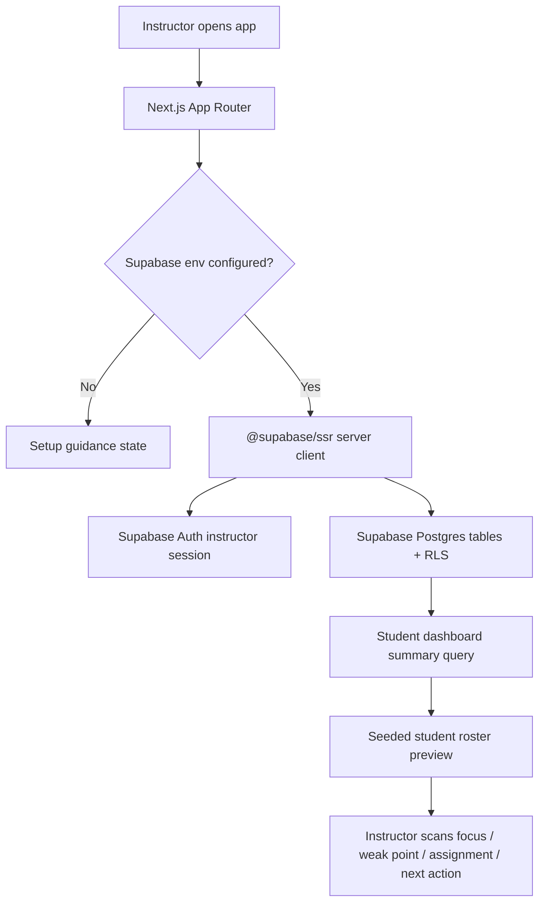

# Phase 1: App Foundation And Data Model - Research

**Researched:** 2026-05-22
**Domain:** Next.js App Router walking skeleton with Supabase/Postgres, hosted ownership boundaries, and a seeded instructor dashboard preview
**Confidence:** HIGH

<user_constraints>
## User Constraints (from CONTEXT.md)

### Locked Decisions

- **D-01:** Phase 1 should be designed for a hosted Supabase/Postgres deployment from the start, not as a SQLite-only local prototype.
- **D-02:** Supabase Auth should be considered for instructor accounts only. Student accounts and portals remain out of scope.
- **D-03:** Student and lesson data must include instructor ownership boundaries from the first schema design.
- **D-04:** Tables exposed through Supabase should be planned with Row Level Security in mind. Planner should avoid designs that assume globally readable student data.
- **D-05:** Local development may still use environment-based Supabase/Postgres connection settings, but the schema should not depend on local-only assumptions.
- **D-06:** Use a hybrid model: structure the fields needed for dashboard summaries and filtering, while preserving free-text detail for lesson reality.
- **D-07:** Core entities should include students, progress items, student traits, lesson notes, assignments, and next lesson plans.
- **D-08:** Structure progress category/status, trait type, assignment status, current-focus markers, dates, and ownership fields.
- **D-09:** Keep detailed observations, weak point descriptions, lesson reflections, and next-lesson details as free text where strict enums would be too limiting.
- **D-10:** Seed data should be MVP demo quality, not minimal fixtures.
- **D-11:** Include 5-7 students with clearly different teaching situations.
- **D-12:** Seed cases should include examples such as complete beginner, hobby adult, audition/practical-music student, student with weak fills, student with poor practice consistency, and student who learns best through demonstration.
- **D-13:** Seed data should make the dashboard meaningful immediately by showing current focus, weak point, assignment status, and next lesson action differences.
- **D-14:** The first working screen should show a sample student dashboard preview backed by seeded database data.
- **D-15:** The preview should surface current focus, primary weak point, assignment status, and next action in a compact list or card layout.
- **D-16:** Do not pull Phase 2 fully into Phase 1. Full student detail read views remain Phase 2 scope.

### the agent's Discretion

- The planner may choose the exact Supabase project setup sequence, migration tooling, and whether Prisma or Supabase client owns each query path, as long as the hosted Supabase/Postgres + ownership/RLS direction is preserved.
- The planner may choose the exact field names and enums, provided the dashboard-summary fields are structured and lesson-specific details remain flexible.

### Deferred Ideas (OUT OF SCOPE)

- Student-facing portal.
- Scheduling automation.
- Payments and invoices.
- Audio/video analysis.
- Full student detail read views.
- Editing workflows.
- Dashboard briefing polish.
</user_constraints>

<architectural_responsibility_map>
## Architectural Responsibility Map

| Capability | Primary Tier | Secondary Tier | Rationale |
|------------|-------------|----------------|-----------|
| Scaffold runnable app | Frontend Server | Browser/Client | Next.js App Router owns routes, layout, server/client component boundaries, and dev/build scripts. |
| Instructor auth foundation | Frontend Server | Supabase Auth | Supabase SSR utilities manage cookie-based sessions; Phase 1 needs instructor ownership without student portal UX. |
| Hosted data model | Database/Storage | Frontend Server | Supabase/Postgres owns tables, RLS policies, and seed data; Next reads summary data for the dashboard preview. |
| Dashboard preview | Browser/Client | Frontend Server | The screen is user-visible and must render seed-backed student summary data without adding Phase 2 detail navigation. |
</architectural_responsibility_map>

<research_summary>
## Summary

Phase 1 should use a Next.js App Router project with TypeScript, Tailwind, shadcn/ui, Supabase SSR, and Supabase/Postgres migrations. The phase is a walking skeleton: a teacher can run the app, seed hosted-style data, and see a real student roster preview loaded from the database.

The original project research mentioned SQLite and Prisma as a fast local MVP path. The later locked context supersedes that recommendation: this phase must start from hosted Supabase/Postgres and instructor ownership/RLS assumptions. Prisma is optional later, but Phase 1 should avoid a Prisma-first plan that weakens RLS or duplicates Supabase migration responsibilities.

**Primary recommendation:** Scaffold a Next.js App Router app using Supabase SSR patterns, create Supabase SQL migrations for instructor-owned student data with RLS policies, seed 5-7 demo students, and render a Huashu-informed shadcn dashboard preview.
</research_summary>

<standard_stack>
## Standard Stack

### Core

| Library | Version | Purpose | Why Standard |
|---------|---------|---------|--------------|
| Next.js | current create-next-app default | App Router, routing, server/client rendering | Official CLI provides TypeScript, Tailwind, App Router, Turbopack defaults. |
| TypeScript | create-next-app default | Type safety | Required for durable data contracts. |
| Tailwind CSS | create-next-app default | Utility styling | Supported by Next and shadcn/ui. |
| shadcn/ui | latest CLI | UI components | Matches UI-SPEC and avoids ad-hoc component styling. |
| lucide-react | shadcn ecosystem | Icons | Use sparingly for functional controls only. |
| @supabase/ssr | latest | Supabase auth/session utilities for SSR frameworks | Supabase recommends this package for server-side auth in Next.js. |
| @supabase/supabase-js | latest | Supabase client | Official client for querying Supabase with auth context. |
| Supabase CLI | latest | Local migrations and seed workflow | Best fit for SQL migrations, RLS, and hosted Supabase projects. |

### Supporting

| Library | Version | Purpose | When to Use |
|---------|---------|---------|-------------|
| zod | latest | Environment validation | Validate required Supabase env vars early. |
| vitest | latest | Unit tests | Use for pure data mapping helpers if introduced. |
| @testing-library/react | latest | Component tests | Use if dashboard rendering logic gets extracted. |
| Playwright | latest | Browser smoke test | Verify first screen loads and handles responsive layout. |

### Alternatives Considered

| Instead of | Could Use | Tradeoff |
|------------|-----------|----------|
| Supabase SQL migrations | Prisma migrations | Prisma helps typed ORM workflows, but SQL migrations are more direct for RLS policies and Supabase-specific auth ownership. |
| Supabase client queries | Prisma server queries | Prisma server queries can bypass the user-auth/RLS mental model unless carefully constrained; Supabase client is simpler for Phase 1. |
| shadcn/ui | Custom components | Custom components invite ad-hoc styling before the design contract is proven. |

**Installation shape:**

```bash
npx create-next-app@latest . --ts --tailwind --eslint --app --src-dir --import-alias "@/*"
npm install @supabase/supabase-js @supabase/ssr zod lucide-react
npx shadcn@latest init
npx shadcn@latest add button badge card separator table skeleton
```
</standard_stack>

<architecture_patterns>
## Architecture Patterns

### System Architecture Diagram



### Recommended Project Structure

```text
src/
├── app/
│   ├── layout.tsx
│   ├── page.tsx
│   └── globals.css
├── components/
│   ├── dashboard/
│   │   ├── student-roster-preview.tsx
│   │   ├── student-summary-row.tsx
│   │   └── setup-status-panel.tsx
│   └── ui/
├── lib/
│   ├── env.ts
│   ├── demo-instructor.ts
│   └── supabase/
│       ├── client.ts
│       ├── server.ts
│       └── queries.ts
└── types/
    └── database.ts
supabase/
├── migrations/
│   └── 0001_foundation.sql
└── seed.sql
```

### Pattern 1: Supabase SSR Client Utilities

**What:** Keep browser and server Supabase clients in `src/lib/supabase`.
**When to use:** Any server component, server action, or route handler that needs Supabase session/query context.
**Why:** Supabase docs recommend dedicated utility files for SSR integrations and note that `@supabase/ssr` is the current package for server-side auth.

### Pattern 2: SQL Migrations Own RLS

**What:** Create Supabase SQL migrations for tables, policies, and seed-safe ownership fields.
**When to use:** Tables that may be exposed through Supabase API.
**Why:** RLS is a database policy concern. SQL keeps ownership rules visible and reviewable.

### Pattern 3: Dashboard Summary Query

**What:** Add one query that returns roster-ready summary records rather than dumping all related lesson data.
**When to use:** Phase 1 dashboard preview.
**Why:** This keeps Phase 1 inside preview scope and prevents accidental Phase 2 detail implementation.

### Anti-Patterns to Avoid

- **SQLite fallback after hosted decision:** Conflicts with D-01 and D-04.
- **Static dashboard mock:** Fails the walking skeleton goal because it does not prove database wiring.
- **All-student global query with no owner filter/RLS:** Conflicts with D-03 and D-04.
- **Full detail page creep:** Phase 2 owns full student detail read views.
- **AI-slop dashboard styling:** UI-SPEC explicitly blocks generic gradients, fake stats, decorative icons, and marketing hero patterns.
</architecture_patterns>

<dont_hand_roll>
## Don't Hand-Roll

| Problem | Don't Build | Use Instead | Why |
|---------|-------------|-------------|-----|
| Auth/session cookies | Custom cookie parser/session manager | `@supabase/ssr` | Supabase maintains Next SSR session patterns. |
| UI primitives | Custom accessible buttons/cards/badges | shadcn/ui + Radix | Faster and safer accessibility baseline. |
| RLS/ownership | App-only filtering | Supabase RLS policies + owner columns | Database-backed authorization is harder to bypass accidentally. |
| Environment validation | Scattered `process.env` checks | `src/lib/env.ts` with zod | Clear setup failure state for Phase 1. |

**Key insight:** Phase 1 should prove the whole stack, not invent framework glue. Use official Supabase/Next/shadcn paths and spend custom effort on domain data shape and dashboard truth.
</dont_hand_roll>

<common_pitfalls>
## Common Pitfalls

### Pitfall 1: Prisma/SQLite Drift From Locked Hosted Scope

**What goes wrong:** Plans follow earlier research and scaffold SQLite/Prisma as the real MVP path.
**Why it happens:** Initial project research predated the Phase 1 context decision.
**How to avoid:** Treat CONTEXT.md D-01 through D-05 as authoritative. Use Supabase/Postgres migrations.
**Warning signs:** `DATABASE_URL=file:` or `sqlite` appears in source plans.

### Pitfall 2: RLS Exists In Name Only

**What goes wrong:** Tables have `instructor_id`, but policies are missing or not tested.
**Why it happens:** The app server can appear to work without RLS checks.
**How to avoid:** Include RLS in migration and verification. Check that policies reference authenticated instructor ownership.
**Warning signs:** Migration creates tables but no `enable row level security` or policy statements.

### Pitfall 3: Seed Data Looks Like Dummy Data

**What goes wrong:** All students have generic names and identical statuses.
**Why it happens:** Seed data is treated as fixture filler.
**How to avoid:** Create 5-7 distinct drum lesson personas with varied progress, weak points, assignment states, and next actions.
**Warning signs:** Seed rows contain repeated values like `Test Student` or `Practice rudiments` everywhere.

### Pitfall 4: Dashboard Becomes Phase 2

**What goes wrong:** Phase 1 builds full student detail and navigation.
**Why it happens:** The roster preview naturally tempts detail expansion.
**How to avoid:** Keep Phase 1 to a preview list and setup states. Link/navigation can be nonfunctional or minimal.
**Warning signs:** Student detail route or edit forms appear in Phase 1 plans.
</common_pitfalls>

<code_examples>
## Code Examples

Verified patterns from official sources:

### Supabase SSR Utilities

```typescript
// Source: https://supabase.com/docs/guides/with-nextjs
// Pattern: keep Supabase server/client utility functions under lib/supabase.
// Implementation should use @supabase/ssr rather than deprecated auth helpers.
```

### RLS Policy Shape

```sql
-- Source: https://supabase.com/docs/guides/database/postgres/row-level-security
alter table students enable row level security;

create policy "Instructors can read their own students"
on students for select
to authenticated
using ((select auth.uid()) = instructor_id);
```

### shadcn Component Add

```bash
# Source: https://ui.shadcn.com/docs/installation/next
npx shadcn@latest add button badge card separator table skeleton
```
</code_examples>

<sota_updates>
## State of the Art (2024-2026)

| Old Approach | Current Approach | When Changed | Impact |
|--------------|------------------|--------------|--------|
| Supabase `@supabase/auth-helpers` | `@supabase/ssr` | Supabase SSR guidance in current docs | Use current SSR utilities for Next App Router. |
| Generic Next setup prompts | `create-next-app` recommended defaults | Current Next CLI docs | TypeScript, Tailwind, App Router, ESLint, and Turbopack are default-friendly. |
| App-only authorization filters | Database RLS with `TO authenticated` policies | Supabase RLS docs emphasize exposed schema safety | Student data ownership must exist in database policy design. |

**New tools/patterns to consider:**
- `create-next-app` recommended defaults for scaffold speed.
- shadcn/ui CLI for controlled component installation.
- Supabase SQL migrations for RLS-first schema.

**Deprecated/outdated:**
- Supabase auth helpers package for SSR-heavy Next apps; prefer `@supabase/ssr`.
</sota_updates>

<open_questions>
## Open Questions

1. **Actual Supabase project credentials**
   - What we know: Phase 1 should target hosted Supabase/Postgres.
   - What's unclear: Whether a project already exists.
   - Recommendation: Plan env-template and setup guidance. Implementation can use placeholders without committing secrets.

2. **Prisma inclusion**
   - What we know: Early research mentioned Prisma, but Phase 1 locked hosted Supabase/RLS direction.
   - What's unclear: Whether the user strongly wants Prisma later.
   - Recommendation: Do not include Prisma in Phase 1 unless a later phase needs ORM-specific workflows. Use SQL migrations now for RLS clarity.
</open_questions>

<sources>
## Sources

### Primary (HIGH confidence)

- Next.js create-next-app docs — current CLI defaults and App Router scaffold options.
- Next.js App Router docs — file-system routing, server/client component direction.
- Supabase Next.js Auth quickstart — with-supabase template and cookie-based auth direction.
- Supabase with Next.js guide — `@supabase/ssr` package and client utility structure.
- Supabase RLS docs — RLS requirement for exposed schemas and authenticated policy shape.
- shadcn/ui Next.js installation docs — CLI init and component add workflow.

### Secondary (MEDIUM confidence)

- Existing project research in `.planning/research/*.md`, adjusted for newer Phase 1 context decisions.

### Tertiary (LOW confidence - needs validation)

- None.
</sources>

<metadata>
## Metadata

**Research scope:**
- Core technology: Next.js App Router, Supabase/Postgres, Supabase SSR, shadcn/ui
- Ecosystem: Tailwind CSS, lucide-react, zod, Supabase CLI
- Patterns: hosted schema ownership, RLS, seeded dashboard preview
- Pitfalls: SQLite drift, RLS gaps, dummy seed data, detail-view scope creep

**Confidence breakdown:**
- Standard stack: HIGH - based on official docs and locked context.
- Architecture: HIGH - phase is a straightforward walking skeleton.
- Pitfalls: HIGH - derived from project constraints and Supabase data-boundary risks.
- Code examples: MEDIUM - examples are shape references; exact generated code should follow installed package versions during execution.
